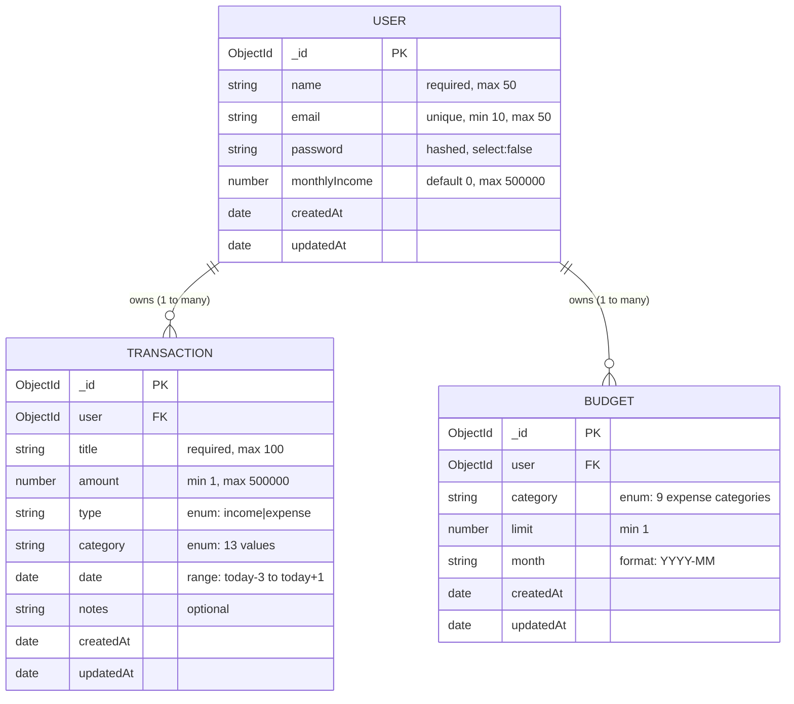

# ExpenseIQ — Full Project Documentation

> **Project:** Expense Tracker with Data Visualization  
> **Course:** B.Tech CSE — GLA University  
> **Author:** Kapil Patel  
> **Version:** 1.0.0  
> **License:** MIT  

---

## Table of Contents

1. [Project Overview](#1-project-overview)
2. [Technology Stack](#2-technology-stack)
3. [Project Architecture](#3-project-architecture)
4. [Directory Structure](#4-directory-structure)
5. [Environment Configuration](#5-environment-configuration)
6. [Database Design (MongoDB Models)](#6-database-design-mongodb-models)
   - 6.1 [User Model](#61-user-model)
   - 6.2 [Transaction Model](#62-transaction-model)
   - 6.3 [Budget Model](#63-budget-model)
   - 6.4 [Database Diagram](#64-database-diagram)
7. [Backend — Routes](#7-backend--routes)
8. [Backend — Middleware](#8-backend--middleware)
9. [Backend — Controllers (Business Logic)](#9-backend--controllers-business-logic)
10. [Frontend — Views (EJS Pages)](#10-frontend--views-ejs-pages)
11. [Frontend — JavaScript](#11-frontend--javascript)
12. [Frontend — CSS](#12-frontend--css)
13. [Authentication & Session Flow](#13-authentication--session-flow)
14. [Data Validation Rules](#14-data-validation-rules)
15. [Data Visualization](#15-data-visualization)
16. [Complete Route Map](#16-complete-route-map)
17. [Data Flow Diagrams](#17-data-flow-diagrams)
18. [Error Handling](#18-error-handling)
19. [Security Measures](#19-security-measures)
20. [Setup & Installation Guide](#20-setup--installation-guide)
21. [npm Scripts](#21-npm-scripts)
22. [Dependencies Reference](#22-dependencies-reference)

---

## 1. Project Overview

**ExpenseIQ** is a full-stack personal finance management web application. It allows users to:

- **Register and login** securely using JWT-based authentication.
- **Track income and expense transactions** across multiple predefined categories.
- **Set monthly budgets** per category and monitor spending against them in real time.
- **Visualize financial data** through interactive bar, line, and donut charts.
- **Generate reports** and export all transaction data as a **CSV file** or a **PDF document**.
- **Manage their profile** — update name/email, change password, set monthly income, and delete their account.

The application uses a **dark, premium UI** with glassmorphism effects, micro-animations, and a fully responsive layout that works on both desktop and mobile.

---

## 2. Technology Stack

| Layer | Technology | Purpose |
|---|---|---|
| Runtime | Node.js | JavaScript server-side execution |
| Web Framework | Express.js v4 | HTTP routing, middleware, request/response |
| Template Engine | EJS (Embedded JavaScript) | Server-side HTML rendering |
| Database | MongoDB (via Mongoose v7) | Persistent data storage |
| Authentication | JSON Web Tokens (JWT) + bcryptjs | Stateless auth, password hashing |
| Session Storage | HTTP-only cookies | Secure token delivery |
| PDF Generation | PDFKit | Server-side PDF report creation |
| Data Charts | Chart.js (CDN) | Client-side interactive charts |
| Icons | Feather Icons (CDN) | SVG icon system |
| CSS | Vanilla CSS (custom design system) | Full styling, animations, responsive layout |
| Dev Tool | Nodemon | Auto-restart on file change |

---

## 3. Project Architecture

ExpenseIQ follows the **MVC (Model–View–Controller)** architectural pattern:

```
Browser (Client)
     │
     │ HTTP Request (GET / POST / DELETE)
     ▼
┌─────────────────────────────────────────────────┐
│                    app.js                       │
│        (Express server initialization)          │
│  - Registers middleware (cookie-parser, JSON)   │
│  - Connects to MongoDB                          │
│  - Mounts route modules                         │
└──────────────────┬──────────────────────────────┘
                   │
         ┌─────────▼──────────┐
         │    Route Layer      │
         │  (routes/*.js)      │
         └─────────┬──────────┘
                   │
         ┌─────────▼──────────┐
         │  Auth Middleware    │
         │ (authMiddleware.js) │
         │ Verifies JWT cookie │
         │ Attaches req.user   │
         └─────────┬──────────┘
                   │
         ┌─────────▼──────────┐
         │  Controller Layer   │
         │ (controllers/*.js)  │
         │ Business logic,     │
         │ validation, DB ops  │
         └─────────┬──────────┘
                   │
         ┌─────────▼──────────┐
         │   Model Layer       │
         │  (models/*.js)      │
         │  Mongoose schemas   │
         │  MongoDB queries    │
         └─────────┬──────────┘
                   │
             MongoDB Database
                   │
         ┌─────────▼──────────┐
         │   View Layer        │
         │  (views/*.ejs)      │
         │  EJS templates      │
         │  rendered + sent    │
         │  to browser         │
         └────────────────────┘
```

---

## 4. Directory Structure

```
ExpenseTracker_with_DataVisualization-main/
│
├── app.js                    # Entry point — Express setup, DB connection, route mounting
├── package.json              # Project metadata and dependencies
├── .env                      # Environment variables (NOT committed to git)
├── .gitignore
├── README.md
├── SECURITY.md
│
├── controllers/
│   ├── authController.js          # Login, Register, Logout
│   ├── transactionController.js   # CRUD for transactions + dashboard data
│   ├── budgetController.js        # Budget CRUD + spending calculation
│   ├── reportController.js        # View reports, export CSV, export PDF
│   └── profileController.js       # Profile, password change, account deletion
│
├── middleware/
│   └── authMiddleware.js          # JWT guard; protects private routes
│
├── models/
│   ├── User.js                    # User account schema
│   ├── Transaction.js             # Income/expense transaction schema
│   └── Budget.js                  # Monthly budget per category schema
│
├── routes/
│   ├── authRoutes.js              # /auth/*
│   ├── transactionRoutes.js       # /transactions/*
│   ├── budgetRoutes.js            # /budget/*
│   ├── reportRoutes.js            # /reports/*
│   └── profileRoutes.js           # /profile/*
│
├── views/
│   ├── home.ejs
│   ├── login.ejs
│   ├── register.ejs
│   ├── dashboard.ejs
│   ├── transactions.ejs
│   ├── budget.ejs
│   ├── reports.ejs
│   ├── profile.ejs
│   ├── settings.ejs
│   └── partials/
│       ├── header.ejs             # HTML <head> with meta, CSS, CDN links
│       └── sidebar.ejs            # Navigation sidebar (reused across all pages)
│
└── public/
    ├── css/
    │   └── style.css              # Full application stylesheet (~44KB)
    └── js/
        ├── charts.js              # Chart.js chart initialization and configuration
        └── main.js                # UI interactions: modals, sidebar, toast, animations
```

---

## 5. Environment Configuration

The `.env` file stores all secrets and configuration. It must exist in the project root.

```dotenv
PORT=3000
MONGO_URI=mongodb://localhost:27017/expenseiq
JWT_SECRET=expenseiq_super_secret_key_2026
JWT_EXPIRE=7d
```

| Variable | Description | Default |
|---|---|---|
| `PORT` | Port number for Express server | `3000` |
| `MONGO_URI` | MongoDB connection string | `mongodb://localhost:27017/expenseiq` |
| `JWT_SECRET` | Secret key used to sign/verify JWTs | Must be kept private |
| `JWT_EXPIRE` | JWT token expiry duration | `7d` (7 days) |

> **Security:** Never commit `.env` to version control. It is excluded via `.gitignore`.

---

## 6. Database Design (MongoDB Models)

### 6.1 User Model

**File:** `models/User.js` | **Collection:** `users`

| Field | Type | Constraints |
|---|---|---|
| `_id` | ObjectId | Auto-generated |
| `name` | String | Required, trimmed, max 50 chars |
| `email` | String | Required, unique, lowercase, min 10, max 50, valid format |
| `password` | String | Required, `select: false` (excluded from queries by default) |
| `monthlyIncome` | Number | Default 0, min 0, max 500000 |
| `createdAt` | Date | Auto (Mongoose timestamps) |
| `updatedAt` | Date | Auto (Mongoose timestamps) |

**Key Design Decisions:**
- `select: false` on `password` ensures the hash is never returned in normal queries. Must be explicitly requested with `.select('+password')` during login/password change.
- `email` has `unique: true` — MongoDB enforces no two accounts share the same email.
- `monthlyIncome` is stored per-user and used to calculate the **savings rate** on the dashboard.

---

### 6.2 Transaction Model

**File:** `models/Transaction.js` | **Collection:** `transactions`

| Field | Type | Constraints |
|---|---|---|
| `_id` | ObjectId | Auto-generated |
| `user` | ObjectId (ref: User) | Required — foreign key |
| `title` | String | Required, trimmed, max 100 chars |
| `amount` | Number | Required, min 1, max 500000 |
| `type` | String | Required, enum: `['income', 'expense']` |
| `category` | String | Required, enum (13 values — see below) |
| `date` | Date | Default: now; validated within [today-3, today+1] |
| `notes` | String | Optional, trimmed, default `''` |
| `createdAt` | Date | Auto |
| `updatedAt` | Date | Auto |

**Allowed Categories:**
- **Expense:** Food, Travel, Health, Shopping, Rent, Entertainment, Education, Utilities, Other
- **Income:** Salary, Freelance, Investment, Gift

**Date Validation Logic:**
```
minDate = today − 3 days   (prevents far backdating)
maxDate = today + 1 day    (prevents far future dating)
valid   = minDate ≤ txDate ≤ maxDate
```

---

### 6.3 Budget Model

**File:** `models/Budget.js` | **Collection:** `budgets`

| Field | Type | Constraints |
|---|---|---|
| `_id` | ObjectId | Auto-generated |
| `user` | ObjectId (ref: User) | Required |
| `category` | String | Required, enum (9 expense categories) |
| `limit` | Number | Required, min 1 |
| `month` | String | Required, format: `YYYY-MM` |
| `createdAt` | Date | Auto |
| `updatedAt` | Date | Auto |

**Unique Compound Index:**
```js
budgetSchema.index({ user: 1, category: 1, month: 1 }, { unique: true })
```
Enforces one budget limit per user per category per month. The `setBudget` controller uses `upsert: true` to update existing entries instead of creating duplicates.

---

### 6.4 Database Diagram

#### Entity-Relationship Diagram (Mermaid)



#### Collection Relationship Overview

```
┌─────────────────────────────────────────────────────────────────────┐
│                         MongoDB Database: expenseiq                 │
│                                                                     │
│  ┌──────────────────────┐                                           │
│  │   Collection: users  │                                           │
│  ├──────────────────────┤                                           │
│  │  _id (ObjectId) ─────┼──────────────────────┐                   │
│  │  name                │                      │                   │
│  │  email (unique)      │                      │                   │
│  │  password (hidden)   │                      │                   │
│  │  monthlyIncome       │                      │                   │
│  │  createdAt           │                      │                   │
│  │  updatedAt           │                      │                   │
│  └──────────────────────┘                      │                   │
│                                                │ user (FK)         │
│                               ┌────────────────┤                   │
│                               │                │                   │
│                               ▼                ▼                   │
│  ┌───────────────────────────────┐  ┌──────────────────────────┐   │
│  │  Collection: transactions     │  │  Collection: budgets     │   │
│  ├───────────────────────────────┤  ├──────────────────────────┤   │
│  │  _id (ObjectId)               │  │  _id (ObjectId)          │   │
│  │  user ──────────────────────► │  │  user ─────────────────► │   │
│  │  title                        │  │  category                │   │
│  │  amount                       │  │  limit                   │   │
│  │  type  (income | expense)     │  │  month (YYYY-MM)         │   │
│  │  category                     │  │  createdAt               │   │
│  │  date                         │  │  updatedAt               │   │
│  │  notes                        │  │                          │   │
│  │  createdAt                    │  │  [Unique Index]           │   │
│  │  updatedAt                    │  │  user+category+month     │   │
│  └───────────────────────────────┘  └──────────────────────────┘   │
└─────────────────────────────────────────────────────────────────────┘
```

#### Relationship Summary

| Relationship | Type | Description |
|---|---|---|
| User → Transaction | One-to-Many (1:N) | One user can have unlimited transactions; each transaction belongs to exactly one user |
| User → Budget | One-to-Many (1:N) | One user can have many budget entries (one per category per month); each budget entry belongs to one user |
| Transaction ↔ Budget | Indirect (via category + month) | Budget spending is calculated by aggregating Transactions by category + date range — no direct foreign key reference |

#### Key Constraints

| Constraint | Collection | Description |
|---|---|---|
| `unique` on `email` | users | No two accounts can share an email address |
| Compound Unique Index | budgets | `{ user, category, month }` — one budget per category per month per user |
| `select: false` on `password` | users | Password hash excluded from all queries unless explicitly requested |
| `enum` on `type` | transactions | Only `'income'` or `'expense'` accepted |
| `enum` on `category` | transactions, budgets | Only predefined category values accepted |
| Date window on `date` | transactions | Must be within [today − 3 days, today + 1 day] |
| `max: 500000` on `amount` | transactions | Single transaction cannot exceed ₹5,00,000 |
| `max: 500000` on `monthlyIncome` | users | Monthly income cannot exceed ₹5,00,000 |

---

## 7. Backend — Routes

### Auth Routes — `/auth`

| Method | Path | Handler | Protected |
|---|---|---|---|
| GET | `/auth/login` | `showLogin` | No |
| POST | `/auth/login` | `loginUser` | No |
| GET | `/auth/register` | `showRegister` | No |
| POST | `/auth/register` | `registerUser` | No |
| GET | `/auth/logout` | `logoutUser` | No |

### Transaction Routes — `/transactions`

| Method | Path | Handler | Protected |
|---|---|---|---|
| GET | `/transactions` | `getTransactions` | Yes |
| POST | `/transactions/add` | `addTransaction` | Yes |
| POST | `/transactions/edit/:id` | `editTransaction` | Yes |
| DELETE | `/transactions/delete/:id` | `deleteTransaction` | Yes |

### Budget Routes — `/budget`

| Method | Path | Handler | Protected |
|---|---|---|---|
| GET | `/budget` | `getBudget` | Yes |
| POST | `/budget/set` | `setBudget` | Yes |
| DELETE | `/budget/delete/:id` | `deleteBudget` | Yes |

### Report Routes — `/reports`

| Method | Path | Handler | Protected |
|---|---|---|---|
| GET | `/reports` | `getReports` | Yes |
| GET | `/reports/export?format=csv` | `exportCSV` | Yes |
| GET | `/reports/export?format=pdf` | `exportPDF` | Yes |

### Profile Routes — `/profile`

| Method | Path | Handler | Protected |
|---|---|---|---|
| GET | `/profile` | `getProfile` | Yes |
| POST | `/profile/update` | `updateProfile` | Yes |
| POST | `/profile/change-password` | `changePassword` | Yes |
| POST | `/profile/update-income` | `updateIncome` | Yes |
| GET | `/profile/delete` | `deleteAccount` | Yes |

### Top-Level Routes (app.js)

| Method | Path | Handler | Protected |
|---|---|---|---|
| GET | `/` | renders `home.ejs` | No |
| GET | `/dashboard` | `getDashboard` | Yes |
| GET | `/settings` | `getSettings` | Yes |
| `*` | `/*` | 404 handler | — |

---

## 8. Backend — Middleware

### `middleware/authMiddleware.js` — `protect`

The JWT authentication guard — applied to every private route.

**Step-by-step flow:**
```
1. Read: token = req.cookies.token
2. If no token → redirect to /auth/login
3. jwt.verify(token, JWT_SECRET) → decoded = { id: userId }
4. User.findById(decoded.id) → user document
5. If user not found → redirect to /auth/login
6. req.user = user  ← attaches user to every protected request
7. next()           ← passes control to the route handler
```

If any step fails (expired/invalid JWT, deleted user account), the middleware safely redirects to login without exposing error details.

---

## 9. Backend — Controllers (Business Logic)

### 9.1 Auth Controller (`controllers/authController.js`)

#### `showLogin`
Renders `login.ejs` with null `error` and `success` props.

#### `loginUser` — Flow:
```
1. Extract { email, password } from req.body
2. Trim email; check both fields are non-empty → render error if not
3. User.findOne({ email }).select('+password')
4. If user not found → "Invalid email or password" (generic — no enumeration)
5. bcrypt.compare(password, user.password)
6. If no match → same generic error message
7. createTokenAndSendCookie(res, user._id)
8. res.redirect('/dashboard')
```

#### `createTokenAndSendCookie` (private helper)
```js
const token = jwt.sign({ id: userId }, JWT_SECRET, { expiresIn: '7d' });
res.cookie('token', token, {
  httpOnly: true,    // JS cannot read this cookie → blocks XSS
  maxAge: 7 * 24 * 60 * 60 * 1000,
  sameSite: 'strict' // Blocks cross-site requests → prevents CSRF
});
```

#### `registerUser` — Validation order:
```
1.  All required fields non-empty (firstName, lastName, email, password)
2.  Valid email format (regex)
3.  password === confirmPassword
4.  8 ≤ password.length ≤ 20
5.  10 ≤ email.length ≤ 50
6.  Email not already registered (DB lookup)
7.  monthlyIncome in [0, 500000] (if provided)
8.  bcrypt.hash(password, 10)
9.  User.create({ name, email, hashedPassword, monthlyIncome })
10. Redirect to /auth/login?registered=true
```

#### `logoutUser`
Sets `token` cookie with `maxAge: 0` (immediately expired), then redirects to login.

---

### 9.2 Transaction Controller (`controllers/transactionController.js`)

#### Helper: `getMonthlySummary(userId, month, year)`
MongoDB aggregation pipeline:
```js
Transaction.aggregate([
  { $match: { user: userId, date: { $gte: startDate, $lte: endDate } } },
  { $group: { _id: '$type', total: { $sum: '$amount' } } }
])
// Returns: { income: Number, expense: Number }
```

#### Helper: `getLast6MonthsData(userId)`
Iterates the past 6 months, calls `getMonthlySummary` for each, returns:
```js
[
  { month: 'Nov', income: 40000, expense: 27000 },
  { month: 'Dec', income: 52000, expense: 35000 },
  ...
]
```
This array feeds the bar/line chart on the dashboard.

#### Helper: `getCategoryData(userId, month, year)`
Aggregates expense transactions for the given month, grouped by category, sorted by amount descending:
```js
[{ category: 'Food', amount: 8960 }, { category: 'Rent', amount: 7840 }, ...]
```
This array feeds the donut chart.

#### `getDashboard`
Runs 4 parallel DB operations with `Promise.all`:
```js
const [summary, recentTransactions, monthlyData, categoryData] = await Promise.all([
  getMonthlySummary(userId, month, year),
  Transaction.find({ user: userId }).sort({ date: -1 }).limit(6),
  getLast6MonthsData(userId),
  getCategoryData(userId, month, year)
]);
res.render('dashboard', { user, summary, transactions: recentTransactions, monthlyData, categoryData });
```
Supports `?month=N` query param for switching the monthly summary filter.

#### `getTransactions`
- Supports URL filters: `?type=income|expense|all` and `?category=Food|...`
- Fetches filtered transactions sorted newest first
- Computes all-time `totalIncome` and `totalExpense` for summary cards
- Renders `transactions.ejs`

#### `addTransaction` — Validation + Create:
```
1. Validate: title, amount, type, category all present
2. Validate: amount is numeric and > 0
3. Validate: amount ≤ 500000
4. Validate: date within [today−3, today+1]
5. Transaction.create({ user: req.user._id, title, amount, type, category, date, notes })
6. Redirect to /transactions?success=Transaction added successfully
```

#### `editTransaction`
Same validations as `addTransaction`, then:
```js
Transaction.findOneAndUpdate(
  { _id: id, user: req.user._id },  // ← Ownership check!
  { ...updatedFields },
  { new: true, runValidators: true }
)
```
The `user: req.user._id` in the query ensures users **cannot edit other users' transactions**.

#### `deleteTransaction`
```js
const deleted = await Transaction.findOneAndDelete({ _id: id, user: req.user._id });
res.json({ success: true, message: 'Transaction deleted' });
```
Returns JSON so the frontend fetches this endpoint and removes the table row without a page reload.

---

### 9.3 Budget Controller (`controllers/budgetController.js`)

#### `getBudget`
1. Builds current month string: `YYYY-MM`
2. Fetches all user budgets for this month
3. Aggregates actual expense spending per category for this month (same aggregation as `getCategoryData`)
4. Merges into `budgetCards` array — each card:

| Field | Formula |
|---|---|
| `spent` | Actual expenses in category this month |
| `pct` | `Math.round((spent / limit) × 100)`, capped at 100 |
| `status` | `'safe'` if pct < 75, `'warning'` if 75–99, `'exceeded'` if ≥ 100 |
| `icon` | Emoji for category (e.g., Food → 🍛) |
| `color` | Hex color for category (e.g., Food → `#f59e0b`) |

5. Computes `totalBudget` (sum of all limits) and `totalSpent` (sum of all actual spending)
6. Renders `budget.ejs`

#### `setBudget`
Uses an **upsert** operation:
```js
Budget.findOneAndUpdate(
  { user: req.user._id, category, month },
  { limit: parseFloat(limit) },
  { upsert: true, new: true, runValidators: true }
)
```
Updates the budget if it exists for that category/month. Creates it if not.

#### `deleteBudget`
Deletes by `_id` + `user` (ownership check), returns JSON response.

---

### 9.4 Report Controller (`controllers/reportController.js`)

#### `getReports`
Fetches all user transactions, computes all-time income/expense totals, renders `reports.ejs`.

#### `exportCSV`
Builds a CSV string in memory:
```
Title,Amount,Type,Category,Date
"Grocery Shopping",1200,expense,Food,17/04/2026
"April Salary",45000,income,Salary,01/04/2026
```
Sets HTTP headers:
```
Content-Type: text/csv
Content-Disposition: attachment; filename="transactions.csv"
```
Browser auto-downloads the file.

#### `exportPDF`
Uses **PDFKit** to build a PDF and stream it directly to the HTTP response:
1. Title: "ExpenseIQ — Financial Report"
2. Generation date
3. Summary: Total Income, Total Expense, Net Balance
4. Full transaction list (numbered, with auto page-break at y > 700)
5. Footer: "Generated by ExpenseIQ"

Sets headers:
```
Content-Type: application/pdf
Content-Disposition: attachment; filename="report.pdf"
```

---

### 9.5 Profile Controller (`controllers/profileController.js`)

#### `getProfile`
Computes stats shown on the profile page:
- `txCount` — total number of the user's transactions
- `budgetCount` — total number of the user's budget entries
- `memberDays` — how many days ago the account was created

#### `updateProfile`
Checks whether the new email is already used by **a different** account (`{ email, _id: { $ne: req.user._id } }`), then updates `name` and `email`.

#### `changePassword`
```
1. newPassword === confirmPassword    (else: error)
2. newPassword.length >= 8           (else: error)
3. User.findById(id).select('+password')
4. bcrypt.compare(currentPassword, stored hash)  (else: "Current password is incorrect")
5. bcrypt.hash(newPassword, 10)
6. User.findByIdAndUpdate(id, { password: hashedNew })
```

#### `updateIncome`
Validates that `monthlyIncome` is a number in `[0, 500000]`, then updates the user document.

#### `getSettings`
Renders `settings.ejs` — no DB queries needed.

#### `deleteAccount` (cascading delete)
```js
await Transaction.deleteMany({ user: req.user._id });
await Budget.deleteMany({ user: req.user._id });
await User.findByIdAndDelete(req.user._id);
res.cookie('token', '', { maxAge: 0 });
res.redirect('/auth/login');
```
Removes all user data across all collections, clears the auth cookie.

---

## 10. Frontend — Views (EJS Pages)

EJS templates are rendered on the server — the final HTML (with data injected) is sent to the browser.

### 10.1 Home Page (`home.ejs`)

Public landing page. Visible to unauthenticated users.

**Sections:**
- Hero with gradient headline and CTA buttons ("Get Started free", "View Demo")
- Feature cards: Smart Tracking, Budget Goals, Reports & Analytics
- Stats section: "10,000+ Users", "₹50Cr+ Tracked" etc.
- Testimonials section
- Footer

**Access:** Public (`GET /`)

---

### 10.2 Login Page (`login.ejs`)

**Features:**
- Email and password fields
- Inline error message display
- Success banner if redirected from registration (`?registered=true`)
- Link to Register page

**Access:** `GET /auth/login` | **Submits to:** `POST /auth/login`

---

### 10.3 Register Page (`register.ejs`)

**Fields:** First Name, Last Name, Email, Password, Confirm Password, Monthly Income (optional)

**Features:**
- Inline error message display
- Password strength hint
- Link to Login page

**Access:** `GET /auth/register` | **Submits to:** `POST /auth/register`

---

### 10.4 Dashboard Page (`dashboard.ejs`)

The main hub of the application. Entirely dynamic.

**EJS variables received:**
```js
{
  user:         { name, email, monthlyIncome, ... },
  summary:      { income: Number, expense: Number },
  transactions: [ ...Transaction objects (last 6)... ],
  monthlyData:  [ { month: 'Jan', income: N, expense: N }, ... ],
  categoryData: [ { category: 'Food', amount: N }, ... ]
}
```

**Sections:**

**1. Topbar**
- Page title + live date (Indian locale, server-rendered)
- Search box (UI only in v1.0)
- Month selector → reloads page with `?month=N`
- Notification bell (UI only)
- "Add Transaction" button → opens modal

**2. Summary Cards**

| Card | Value |
|---|---|
| Total Income | `summary.income` |
| Total Expense | `summary.expense` |
| Net Balance | `summary.income − summary.expense` |
| Savings Rate | `((income − expense) / income) × 100`% |

**3. Charts Row**
- **Bar/Line Chart** (`canvas#incomeExpenseChart`): Income vs Expense — last 6 months; switchable via "Bar"/"Line" tab buttons
- **Donut Chart** (`canvas#categoryDonut`): Spending breakdown by category — current month; custom HTML legend below

**4. Recent Transactions**
- Last 6 transactions (date descending)
- Per row: category emoji, title, date, category badge, amount (green +/red −)
- "View all →" link

**5. Category Breakdown**
- Static demo progress bars per category (hardcoded visual component)

**6. Add Transaction Modal**
- Expense/Income type toggle
- Fields: Title, Amount, Date (default: today), Category, Notes
- Submits to `POST /transactions/add`
- Closes on backdrop click or Escape key

---

### 10.5 Transactions Page (`transactions.ejs`)

Full transaction management.

**Features:**
- Filter bar: Type (All / Income / Expense) + Category dropdown
- All-time income and expense summary
- Full table: Title | Category | Date | Type | Amount | Actions (Edit, Delete)
- **Add Transaction** button (same modal as dashboard)
- **Edit** → pre-fills modal/form with existing transaction data
- **Delete** → calls `DELETE /transactions/delete/:id` via `fetch()`, removes row from DOM without reload
- Toast notifications from `?success=` / `?error=` URL params

**Access:** Protected (`GET /transactions`)

---

### 10.6 Budget Page (`budget.ejs`)

Monthly budget tracker.

**Features:**
- Set Budget form: Category dropdown + Limit amount + hidden current month
- Budget cards (one per set budget):
  - Category icon + name + limit
  - Amount spent vs limit
  - Progress bar (green/yellow/red based on status)
  - Status badge: Safe / Warning / Exceeded
  - Delete button
- Total budget summary banner

**Access:** Protected (`GET /budget`)  
**Set budget:** `POST /budget/set`  
**Delete budget:** `DELETE /budget/delete/:id`

---

### 10.7 Reports Page (`reports.ejs`)

Financial report viewer + export.

**Features:**
- Summary cards: income, expense, net balance
- Full transaction history table
- **Export CSV** → downloads `transactions.csv`
- **Export PDF** → downloads `report.pdf`

**Access:** Protected (`GET /reports`)

---

### 10.8 Profile Page (`profile.ejs`)

User account management.

**Sections:**
1. Profile header: avatar (first initial), name, email, member-since
2. Stats row: Transactions count, Budgets count, Days as member
3. Edit Profile form (name, email)
4. Change Password form (current → new → confirm)
5. Monthly Income form
6. Flash success/error messages (from URL query params)

**Access:** Protected (`GET /profile`)

---

### 10.9 Settings Page (`settings.ejs`)

**Sections:**
- Account settings shortcuts
- Currency preference (INR, display only)
- **Danger Zone:** Delete Account button (triggers confirmation dialog → `GET /profile/delete`)

**Access:** Protected (`GET /settings`)

---

### 10.10 Partials

#### `views/partials/header.ejs`
Included at the top of every EJS page. Contains:
- `<!DOCTYPE html>`, `<html>`, `<head>`
- `<meta charset>`, `<meta viewport>`, `<title>` (dynamic)
- `/css/style.css` stylesheet link
- CDN: **Chart.js**, **Feather Icons**, **Google Fonts (DM Sans)**

#### `views/partials/sidebar.ejs`
Included on all authenticated pages. Contains:
- ExpenseIQ logo (₹ symbol + text) → links to `/dashboard`
- User avatar (first letter of `user.name`) + name + email
- Navigation links with dynamic active state:
  ```ejs
  class="nav-item <%= page === 'dashboard' ? 'active' : '' %>"
  ```
  Pages: Dashboard, Transactions, Budget, Reports, Profile, Settings
- Logout link at bottom
- Mobile hamburger button + overlay

---

## 11. Frontend — JavaScript

### 11.1 `charts.js` — Data Visualization

**File:** `public/js/charts.js`

#### Color Palette (`CHART_COLORS`)
```js
income:        '#00c896'   // Green
expense:       '#ff5c7a'   // Red/Pink
Food:          '#f59e0b'   // Amber
Rent:          '#ff5c7a'   // Red
Travel:        '#4f8dff'   // Blue
Shopping:      '#a78bfa'   // Purple
Health:        '#00c896'   // Green
Entertainment: '#ff9500'   // Orange
Education:     '#00b4d8'   // Cyan
Utilities:     '#48cae4'   // Light Blue
Other:         '#3d526e'   // Muted
```

#### `initBarChart(monthlyData, type = 'bar')`
- Renders bar or line chart on `canvas#incomeExpenseChart`
- Two datasets: Income (green) and Expense (red/pink)
- Dark theme: grid `#1a2840`, text `#7a90b5`, background `#111827`
- Y-axis formatter: values ≥ 1000 → `₹42k`
- `interaction: { mode: 'index' }` → hovering shows both datasets simultaneously
- Line mode: enables area fill, smooth tension (0.4), visible data points

#### `switchChartType(type, btn)`
Reads current chart data, destroys chart instance, re-initializes with new type. Updates active tab button.

#### `initDonutChart(categoryData)`
- Renders doughnut on `canvas#categoryDonut`
- `cutout: '68%'` for the donut hole
- Legend disabled (replaced by `buildDonutLegend`)

#### `buildDonutLegend(labels, amounts, colors)`
Dynamically builds HTML legend items in `div#donutLegend`:
- Colored dot + category name + percentage of total spending

---

### 11.2 `main.js` — UI Interactions

**File:** `public/js/main.js`

#### Modal Management
```js
openModal()           // Adds .open class to #modalBackdrop
closeModal()          // Removes .open class
closeModalOutside(e)  // Closes only if backdrop (not modal box) was clicked
// Escape key listener closes any open modal
```

#### Transaction Type Toggle — `setType(type)`
- Updates hidden `<input name="type">` value to `'income'` or `'expense'`
- Swaps CSS class between `active-expense` / `active-income` on the toggle buttons

#### Toast Notifications — `showToast(message, type)`
```
Types: 'success' (✓ green), 'error' (✗ red), 'info' (ℹ blue)
- Creates toast div with icon, message, close button
- Appended to #toastContainer
- Auto-dismisses after 3500ms with fade-out animation
```

#### Mobile Sidebar Toggle
```js
sidebarToggle.addEventListener('click', () => {
  sidebar.classList.toggle('open');
  overlay.style.display = sidebar.classList.contains('open') ? 'block' : 'none';
});
// closeSidebar() called when user taps the overlay
```

#### Number Count Animation — `animateCount(el, target, duration)`
On `DOMContentLoaded`, animates all `.card-amount` elements from 0 to their real value using **cubic ease-out**:
```
eased = 1 − (1 − progress)³
```
Creates a "counting up" effect on the dashboard summary cards.

#### `formatINR(amount)`
```js
formatINR(45000) // → "₹45,000"
```

---

## 12. Frontend — CSS

**File:** `public/css/style.css` (~44KB)

Single custom CSS file implementing a complete dark design system.

**CSS Variables (Design Tokens):**
```css
:root {
  --bg:       #080d1a;   /* Dark navy page background */
  --surface:  #0d1526;   /* Card/panel background */
  --border:   #1a2840;   /* Subtle borders */
  --accent:   #00c896;   /* Primary teal/green accent */
  --income:   #00c896;   /* Income color */
  --expense:  #ff5c7a;   /* Expense color */
  --text-1:   #eef2ff;   /* Primary text */
  --text-2:   #7a90b5;   /* Muted/secondary text */
  --blue:     #4f8dff;   /* Links and info */
}
```

**Key Component Classes:**

| Class | Purpose |
|---|---|
| `.app-layout` | CSS Grid: `240px sidebar + 1fr main content` |
| `.sidebar` | Fixed left navigation panel |
| `.topbar` | Sticky top bar with actions |
| `.summary-card` | Glassmorphism stat card |
| `.card` | Generic dark panel |
| `.modal-backdrop` | Full-screen overlay |
| `.modal-box` | Centered dialog container |
| `.type-toggle` | Expense/Income switch buttons |
| `.btn-primary` | Gradient green action button |
| `.btn-outline` | Ghost/outline button |
| `.badge-*` | Color-coded category label badges |
| `.toast-*` | Notification toasts (slide-in animation) |
| `.nav-item.active` | Active sidebar link highlight |
| `.empty-state` | Centered empty state UI |

**Responsive Design:**
- Breakpoint: `@media (max-width: 768px)`
- Sidebar hides off-screen; toggled by hamburger button
- Cards stack vertically
- Tables get horizontal scroll

---

## 13. Authentication & Session Flow

```
REGISTRATION
─────────────
POST /auth/register
  → Validate all fields
  → bcrypt.hash(password, 10)
  → User.create(...)
  → Redirect to /auth/login?registered=true

LOGIN
──────
POST /auth/login
  → User.findOne({ email }).select('+password')
  → bcrypt.compare(plainPassword, hash)
  → jwt.sign({ id: userId }, JWT_SECRET, { expiresIn: '7d' })
  → res.cookie('token', JWT, { httpOnly:true, sameSite:'strict', maxAge: 7days })
  → Redirect to /dashboard

PROTECTED REQUEST
──────────────────
Browser automatically sends cookie with every request
  → authMiddleware: req.cookies.token
  → jwt.verify(token, JWT_SECRET) → { id }
  → User.findById(id) → req.user
  → next() → Controller runs

LOGOUT
───────
GET /auth/logout
  → res.cookie('token', '', { maxAge: 0 })   ← instantly expires
  → Redirect to /auth/login
```

---

## 14. Data Validation Rules

Validation is enforced at two layers: **Controller** (main guard) and **Mongoose Schema** (safety net).

### Registration / User

| Field | Rule | Error |
|---|---|---|
| firstName, lastName | Required | "Please fill in all required fields" |
| email | Required, valid format | "Please provide a valid email format" |
| email | Length: 10–50 chars | "Email must be between 10 to 50 characters" |
| password | Length: 8–20 chars | "Password must be between 8 to 20 characters" |
| confirmPassword | Must match password | "Passwords do not match" |
| email | Must be unique | "Email is already registered. Please login." |
| monthlyIncome | Numeric, 0–500000 | "Monthly income must be between 0 and 500000" |

### Transactions

| Field | Rule | Error |
|---|---|---|
| title | Required | "Please fill all required fields" |
| amount | Numeric, > 0 | "Amount must be a valid positive number" |
| amount | Max 500000 | "Amount cannot exceed 500000" |
| type | `income` or `expense` | (Mongoose enum) |
| category | Valid category | (Mongoose enum) |
| date | Within [today−3, today+1] | "Date must be within the past 3 days and next 1 day" |

### Budget

| Field | Rule |
|---|---|
| category | Required, valid enum |
| limit | Required, numeric, min 1 |
| month | Required (YYYY-MM) |

### Profile / Password

| Field | Rule | Error |
|---|---|---|
| newPassword | Min 8 chars | "Password must be at least 8 characters" |
| newPassword | Matches confirmPassword | "New passwords do not match" |
| currentPassword | Matches stored hash | "Current password is incorrect" |
| monthlyIncome | Numeric, 0–500000 | "Monthly income must be between 0 and 500000" |

---

## 15. Data Visualization

### Data Flow for Charts

```
MongoDB Aggregation
  ↓
transactionController.js
  · getMonthlySummary() × 6 months → monthlyData[]
  · getCategoryData()              → categoryData[]
  ↓
dashboard.ejs (server renders HTML)
<script>
  const MONTHLY_DATA  = <%- JSON.stringify(monthlyData) %>;
  const CATEGORY_DATA = <%- JSON.stringify(categoryData) %>;
  initBarChart(MONTHLY_DATA);
  initDonutChart(CATEGORY_DATA);
</script>
  ↓ (browser executes JS)
charts.js
  · Canvas#incomeExpenseChart ← Bar/Line chart
  · Canvas#categoryDonut      ← Donut chart
```

### Chart: Income vs Expense (Bar/Line)

- X-axis: 6 month labels (e.g., "Nov", "Dec", "Jan")
- Y-axis: amounts formatted as `₹42k`
- Dataset 1: Income (green)
- Dataset 2: Expense (red/pink)
- Toggle: "Bar" / "Line" tab buttons switch type without reloading page
- Dark-themed tooltips, grid lines, and labels

### Chart: Spending by Category (Donut)

- Each segment = one spending category
- Colors match the application's color palette
- `cutout: '68%'` for the donut hole effect
- Custom HTML legend: colored dot + name + percentage

---

## 16. Complete Route Map

```
GET   /                                → home.ejs               (public)
GET   /auth/login                      → login.ejs              (public)
POST  /auth/login                      → loginUser              (public)
GET   /auth/register                   → register.ejs           (public)
POST  /auth/register                   → registerUser           (public)
GET   /auth/logout                     → clear cookie, redirect (public)

GET   /dashboard                       → dashboard.ejs          (protected)
GET   /dashboard?month=N               → filtered dashboard      (protected)

GET   /transactions                    → transactions.ejs       (protected)
GET   /transactions?type=X&category=Y  → filtered transactions  (protected)
POST  /transactions/add                → addTransaction         (protected)
POST  /transactions/edit/:id           → editTransaction        (protected)
DEL   /transactions/delete/:id         → deleteTransaction JSON (protected)

GET   /budget                          → budget.ejs             (protected)
POST  /budget/set                      → setBudget              (protected)
DEL   /budget/delete/:id               → deleteBudget JSON      (protected)

GET   /reports                         → reports.ejs            (protected)
GET   /reports/export?format=csv       → download transactions.csv (protected)
GET   /reports/export?format=pdf       → download report.pdf    (protected)

GET   /profile                         → profile.ejs            (protected)
POST  /profile/update                  → updateProfile          (protected)
POST  /profile/change-password         → changePassword         (protected)
POST  /profile/update-income           → updateIncome           (protected)
GET   /profile/delete                  → deleteAccount cascade  (protected)

GET   /settings                        → settings.ejs           (protected)

*                                      → 404 page               (fallback)
```

---

## 17. Data Flow Diagrams

### Adding a Transaction

```
User submits Add Transaction form
  ↓
POST /transactions/add
  ↓
authMiddleware → verify JWT → req.user
  ↓
transactionController.addTransaction
  ├─ Validate fields (non-empty, numeric, range, date window)
  └─ Transaction.create({ user: req.user._id, ...fields })
        ↓
     MongoDB: insert into 'transactions' collection
        ↓
     res.redirect('/transactions?success=Transaction added successfully')
        ↓
     Browser: transactions page loads + showToast('...', 'success')
```

### Loading the Dashboard

```
GET /dashboard?month=3
  ↓
authMiddleware → req.user
  ↓
getDashboard — Promise.all([
  getMonthlySummary(userId, 3, 2026)      → {income, expense} for April
  Transaction.find().sort(-date).limit(6) → last 6 transactions
  getLast6MonthsData(userId)              → 6-month history for chart
  getCategoryData(userId, 3, 2026)        → category breakdown for donut
])
  ↓
res.render('dashboard', { user, summary, transactions, monthlyData, categoryData })
  ↓
EJS builds full HTML with embedded JSON data
  ↓
Browser receives HTML → Chart.js reads MONTHLY_DATA + CATEGORY_DATA
  ↓
initBarChart() → renders Income vs Expense chart
initDonutChart() → renders Spending by Category chart
animateCount() → card numbers count up from 0
```

---

## 18. Error Handling

### Controller-Level
Every controller uses `try/catch`. On error:
- **Page renders:** re-render page with safe defaults (empty arrays, zero values)
- **JSON APIs (delete):** return `{ success: false, message: '...' }` with `500` status
- All errors logged: `console.error('Context:', error)`

### Form Validation Errors
- **Auth pages:** re-render the form with an `error` variable shown as an inline alert box
- **App pages:** `res.redirect('/page?error=message')` — EJS reads the query param and calls `showToast(message, 'error')`

### 404 Handler
Last middleware in `app.js`:
```js
app.use((req, res) => {
  res.status(404).send(`
    <div style="...dark fullscreen styles...">
      💸
      <h1>404 — Page Not Found</h1>
      <a href="/dashboard">← Back to Dashboard</a>
    </div>
  `);
});
```

---

## 19. Security Measures

| Measure | Implementation |
|---|---|
| Password Hashing | `bcryptjs` with 10 salt rounds — passwords never stored in plain text |
| JWT Authentication | Tokens signed with `JWT_SECRET`, expire after 7 days |
| HTTP-only Cookies | JWT in `httpOnly` cookie — inaccessible to JavaScript, blocks XSS token theft |
| SameSite Cookie | `sameSite: 'strict'` — blocks cross-site cookie sending, prevents CSRF |
| Ownership Checks | Every DB query includes `user: req.user._id` — users cannot access others' data |
| `select: false` | Password hash excluded from all queries unless explicitly `.select('+password')` |
| Input Trimming | All string inputs `.trim()`-ed before DB writes |
| `.gitignore` | `.env` excluded from version control |
| Generic Auth Errors | Login returns "Invalid email or password" for both wrong email AND wrong password — prevents user enumeration attacks |

---

## 20. Setup & Installation Guide

### Prerequisites

- [Node.js](https://nodejs.org/) v16 or higher
- [MongoDB Community Server](https://www.mongodb.com/try/download/community) running locally (or a MongoDB Atlas connection string)

### Step-by-Step

**1. Clone or extract the project**
```bash
cd ExpenseTracker_with_DataVisualization-main
```

**2. Install dependencies**
```bash
npm install
```

**3. Create the environment file**

Create `.env` in the project root:
```dotenv
PORT=3000
MONGO_URI=mongodb://localhost:27017/expenseiq
JWT_SECRET=your_strong_random_secret_here
JWT_EXPIRE=7d
```

**4. Ensure MongoDB is running**
```bash
# Windows (start manually if not running as a service)
mongod
```

**5. Start the development server**
```bash
npm run dev
```

Console output:
```
✅ MongoDB connected!

  🚀  ExpenseIQ is running!

  🏠  Home         →  http://localhost:3000/
  🔐  Login        →  http://localhost:3000/auth/login
  📊  Dashboard    →  http://localhost:3000/dashboard
  👤  Profile      →  http://localhost:3000/profile
  ⚙️   Settings     →  http://localhost:3000/settings
```

**6. Open the app**

Go to `http://localhost:3000` and register a new account to begin.

---

## 21. npm Scripts

| Script | Command | Description |
|---|---|---|
| `npm start` | `node app.js` | Production start (no auto-restart) |
| `npm run dev` | `nodemon app.js` | Development start — auto-restarts on file save |

---

## 22. Dependencies Reference

### Production Dependencies

| Package | Version | Purpose |
|---|---|---|
| `express` | ^4.18.2 | Web framework |
| `mongoose` | ^7.3.1 | MongoDB ODM — schemas, validation, queries |
| `ejs` | ^3.1.9 | Server-side template engine |
| `bcryptjs` | ^2.4.3 | Password hashing (pure JS, no native bindings) |
| `jsonwebtoken` | ^9.0.0 | JWT creation and verification |
| `cookie-parser` | ^1.4.6 | Parses `Cookie` header into `req.cookies` |
| `dotenv` | ^16.0.3 | Loads `.env` into `process.env` |
| `pdfkit` | ^0.18.0 | Server-side PDF generation, streamed to response |

### Development Dependencies

| Package | Version | Purpose |
|---|---|---|
| `nodemon` | ^3.0.1 | Auto-restarts Node on file changes |

### CDN Dependencies (in `header.ejs`)

| Library | Purpose |
|---|---|
| Chart.js | Client-side interactive canvas charts |
| Feather Icons | Lightweight SVG icon set (`data-feather="..."`) |
| DM Sans (Google Fonts) | Primary sans-serif typeface |

---

*Documentation for ExpenseIQ v1.0.0 — Expense Tracker with Data Visualization*  
*B.Tech CSE Project, GLA University — Author: Kapil Patel*
